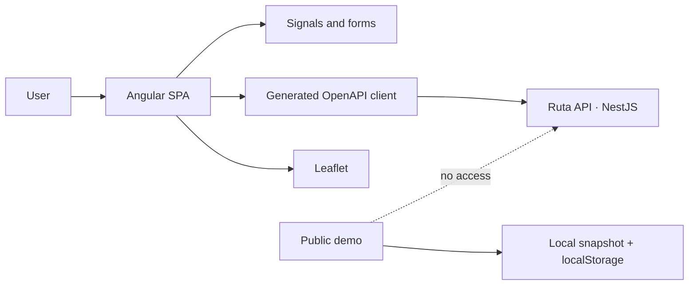

<div align="center">

# Ruta

### A visual, privacy-conscious web client for trip planning

[](https://angular.dev/)
[](https://www.typescriptlang.org/)
[](https://playwright.dev/)
[](https://ruta-rubenasua.vercel.app/)

[Public demo](https://ruta-rubenasua.vercel.app/) ·
[Case study](https://rubenasua.vercel.app/projects/ruta) ·
[API](https://github.com/rubenasuasoto/ruta-api) ·
[Español](README.md)

</div>

Ruta is an Angular 22 SPA for organising itineraries, budgets, saved places and personal maps. It uses signals, reactive forms, Leaflet and a generated TypeScript SDK based on the API's OpenAPI contract.

The public demo exposes the product experience without requiring an account. It is isolated from the private service and runs on an editable, fictional Valencia snapshot stored only in the browser.

## What it demonstrates

| Area | Implementation |
|---|---|
| Product | Day-by-day itineraries, budget, map, places and account management |
| Architecture | Angular components, signal-based state and a generated OpenAPI client |
| Integration | A typed contract shared with NestJS and multimodal routing |
| Security | Invite-only private access, in-memory access tokens and validated returns |
| Quality | ESLint, unit tests, coverage and Playwright end-to-end journeys |

## Architecture



The private application consumes `ruta-api` through `/api`. During a visit, the demo does not initialise a session or call the API, remote map tiles, geocoding, routing or OpenAI.

## Public demo

`/demo?tour=1` opens a fictional Valencia trip with a summary, itinerary, budget, map, places and technical presentation. The tour can be advanced, revisited or skipped.

- Places and geometries come from a real geographic snapshot.
- The trip, schedule, costs and recommendations are fictional.
- The editable copy is stored under `ruta.portfolio-demo.v2` in `localStorage`.
- “Restore trip” removes only that local copy.
- The map uses `public/assets/demo/valencia-map.svg`.
- Google Maps opens only after an explicit marker action.

The location picker searches a frozen local catalogue; it is not presented as a global geocoder. Images are generic editorial assets by category rather than exact photographs of each address.

## Local development

Requirements: a Node.js version supported by Angular 22 and the sibling [`ruta-api`](https://github.com/rubenasuasoto/ruta-api) repository.

```bash
# In ruta-api
docker compose up --build

# In this repository
npm ci
npm start
```

Open `http://localhost:4200`. The local proxy forwards `/api` to NestJS, while Mailpit displays development emails at `http://localhost:8025`.

To run only the public experience:

```bash
npm run start:demo
```

## Typed contract

The SDK in `src/app/api` is generated from the API's OpenAPI contract:

```bash
npm run api:sync
npm run check:api
```

`check:api` fails when generation leaves uncommitted changes, helping to detect drift between client and server.

## Validation

```bash
npm run lint
npm test -- --watch=false
npm run test:coverage
npm run build
npm run build:demo
npm run test:e2e:demo
npm run check:security
```

## Private accounts

- Open registration is disabled; accounts originate from personal invitations.
- An invitation fixes the email address, expires and can only be used once.
- The product includes password recovery, verification, email changes, session management, data export and account deletion.
- Access tokens stay in memory; renewal relies on an API-managed `HttpOnly` cookie.
- Google Identity Services and Turnstile activate only when the API exposes the required non-secret configuration.

See [SECURITY.en.md](SECURITY.en.md) for the security model and [THIRD_PARTY_NOTICES.md](THIRD_PARTY_NOTICES.md) for attribution.

## Status

This repository is published as a technical case study and portfolio demo. The private application is not open for general registration.

## Licence

No general reuse licence is granted. Dependencies and third-party assets retain their original licences.
