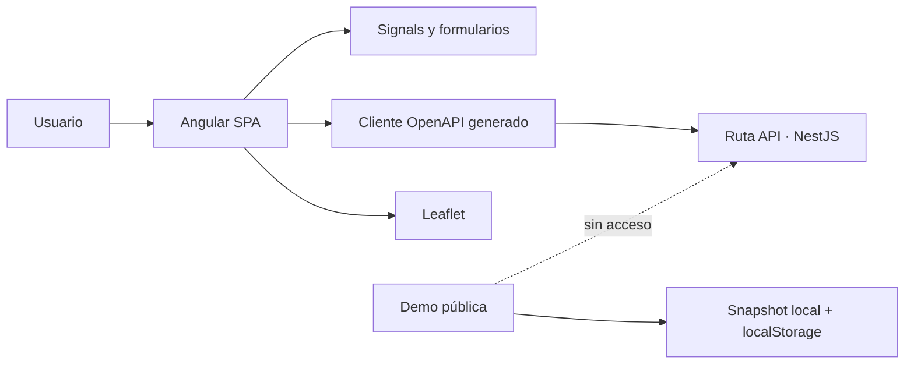

<div align="center">

# Ruta

### Cliente web para planificar viajes de forma visual y privada

[](https://angular.dev/)
[](https://www.typescriptlang.org/)
[](https://playwright.dev/)
[](https://ruta-rubenasua.vercel.app/)

[Demo pública](https://ruta-rubenasua.vercel.app/) ·
[Caso de estudio](https://rubenasua.vercel.app/projects/ruta) ·
[API](https://github.com/rubenasuasoto/ruta-api) ·
[English](README.en.md)

</div>

Ruta es una SPA desarrollada con Angular 22 para organizar itinerarios, presupuestos, lugares guardados y mapas personales. El cliente usa signals, formularios reactivos, Leaflet y un SDK TypeScript generado desde el contrato OpenAPI de la API.

La demo pública permite recorrer el producto sin cuenta y está aislada del servicio privado: trabaja con una instantánea ficticia y editable de Valencia, almacenada exclusivamente en el navegador.

## Qué demuestra

| Área | Implementación |
|---|---|
| Producto | Itinerarios por jornadas, presupuesto, mapa, lugares y gestión de cuenta |
| Arquitectura | Componentes Angular, estado con signals y cliente OpenAPI generado |
| Integración | Contrato tipado compartido con NestJS y rutas multimodales |
| Seguridad | Acceso privado por invitación, tokens solo en memoria y retorno validado |
| Calidad | ESLint, pruebas unitarias, cobertura y recorridos E2E con Playwright |

## Arquitectura



La aplicación privada consume `ruta-api` a través de `/api`. La demo, en cambio, no inicializa sesión ni consulta la API, mapas remotos, geocodificación, rutas u OpenAI durante una visita.

## Demo pública

La ruta `/demo?tour=1` abre un viaje ficticio por Valencia con resumen, itinerario, presupuesto, mapa, lugares y explicación técnica. La guía se puede avanzar, retroceder o saltar.

- Los lugares y geometrías proceden de una captura geográfica real.
- El viaje, los horarios, los costes y las recomendaciones son ficticios.
- La copia editable se guarda en `localStorage` bajo `ruta.portfolio-demo.v2`.
- «Restaurar viaje» elimina únicamente esa copia local.
- El mapa usa el recurso local `public/assets/demo/valencia-map.svg`.
- Google Maps solo se abre tras una acción explícita sobre un marcador.

El selector de ubicación busca en un catálogo local congelado; no pretende sustituir a un geocodificador global. Las imágenes son recursos editoriales genéricos por categoría, no fotografías exactas de cada dirección.

## Desarrollo local

Requisitos: Node.js compatible con Angular 22 y el repositorio hermano [`ruta-api`](https://github.com/rubenasuasoto/ruta-api).

```bash
# En ruta-api
docker compose up --build

# En este repositorio
npm ci
npm start
```

Abre `http://localhost:4200`. El proxy local envía `/api` a NestJS y Mailpit muestra los correos de desarrollo en `http://localhost:8025`.

Para ejecutar solo la experiencia pública:

```bash
npm run start:demo
```

## Contrato tipado

El SDK de `src/app/api` se genera desde el contrato OpenAPI de la API:

```bash
npm run api:sync
npm run check:api
```

`check:api` falla si la generación deja cambios sin versionar, lo que ayuda a detectar divergencias entre cliente y servidor.

## Validación

```bash
npm run lint
npm test -- --watch=false
npm run test:coverage
npm run build
npm run build:demo
npm run test:e2e:demo
npm run check:security
```

## Cuentas privadas

- El registro abierto está deshabilitado; las cuentas nacen de invitaciones personales.
- La invitación fija el correo, caduca y solo puede usarse una vez.
- La aplicación incluye recuperación de contraseña, verificación, cambio de correo, sesiones, exportación y eliminación de cuenta.
- Los access tokens permanecen en memoria; la renovación usa una cookie `HttpOnly` administrada por la API.
- Google Identity Services y Turnstile solo se activan cuando la API publica su configuración no secreta.

Consulta [SECURITY.md](SECURITY.md) para el modelo de seguridad y [THIRD_PARTY_NOTICES.md](THIRD_PARTY_NOTICES.md) para atribuciones.

## Estado

El repositorio se publica como caso técnico y demo de portfolio. La aplicación privada no está abierta al registro general.

## Licencia

No se concede una licencia de reutilización general. Las dependencias y recursos de terceros conservan sus licencias originales.
